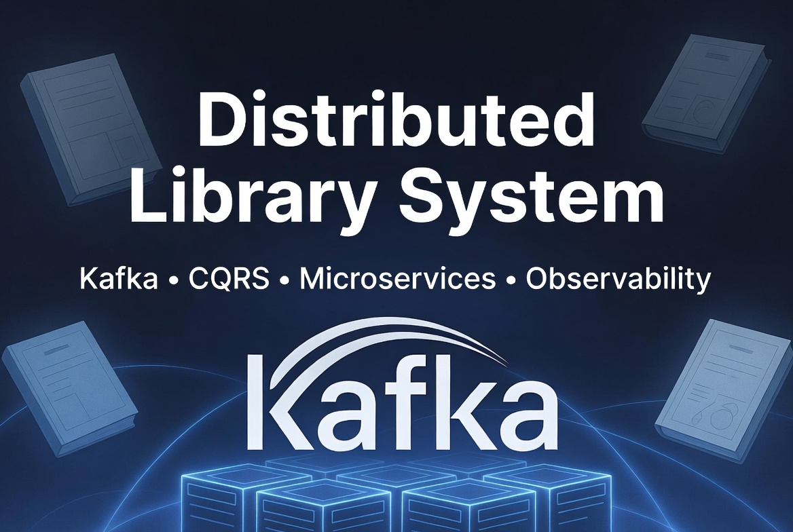
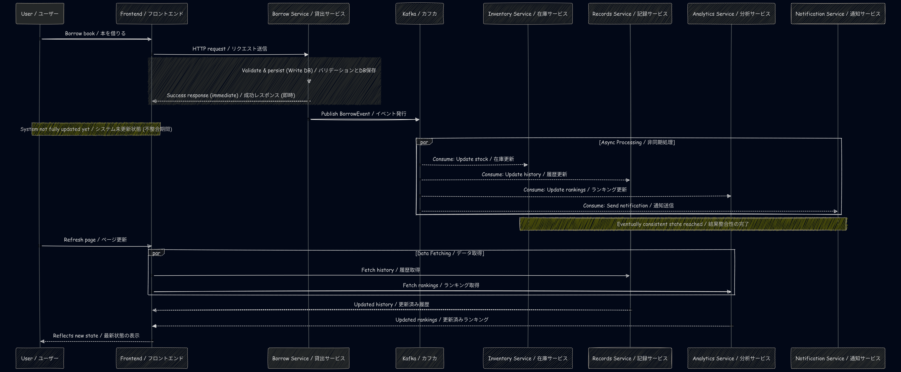
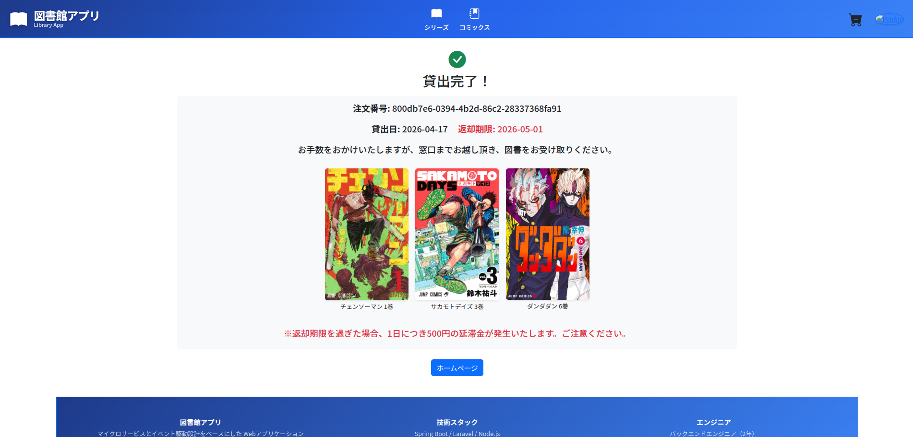
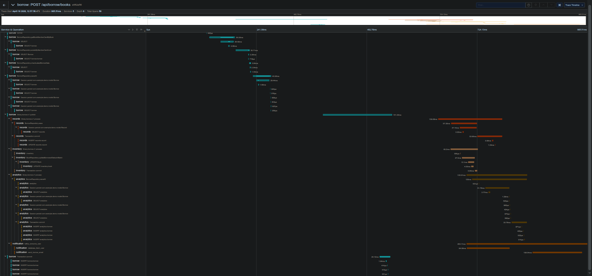
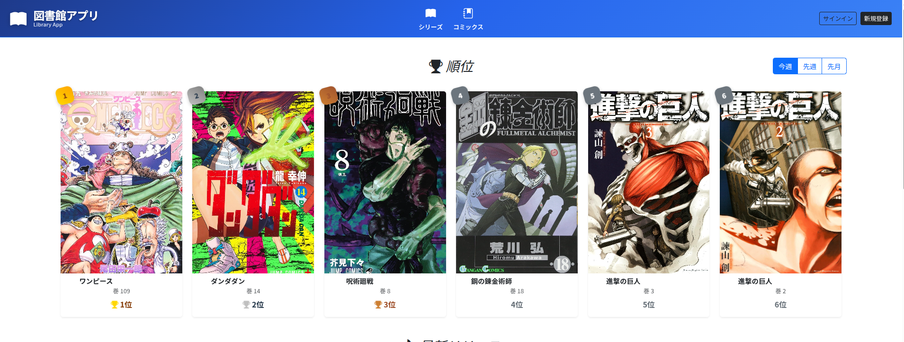
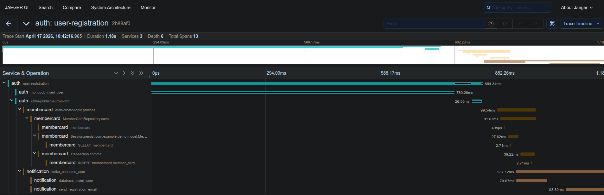
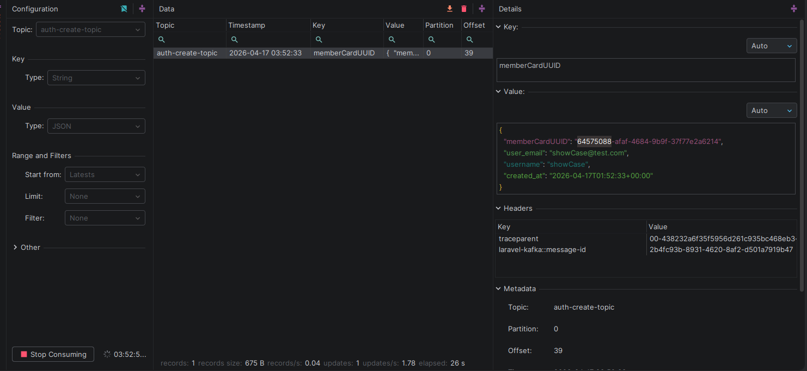
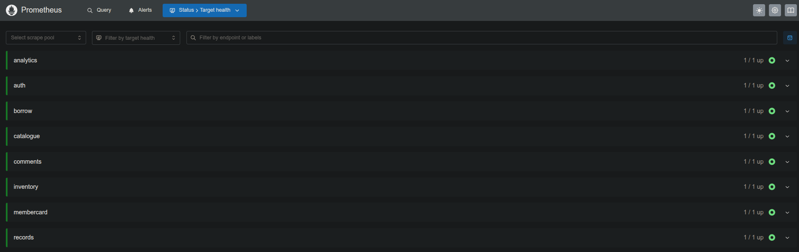
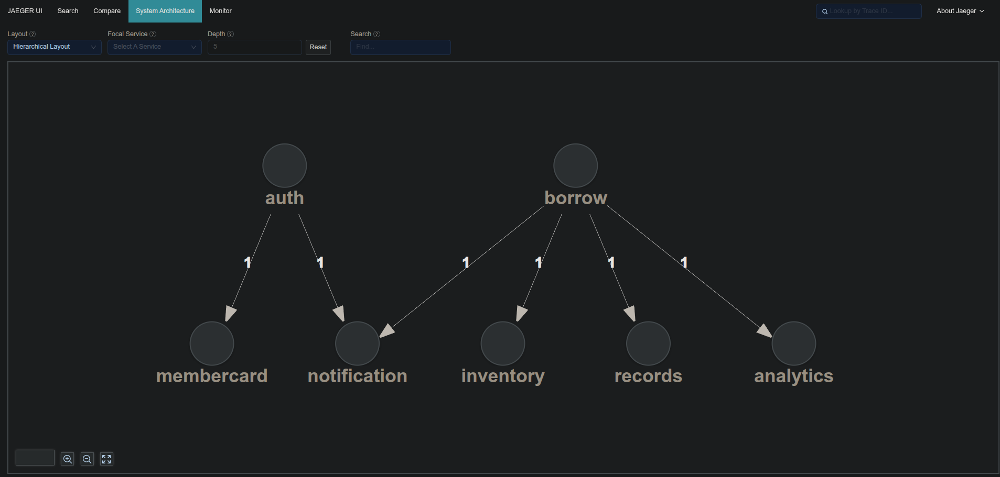
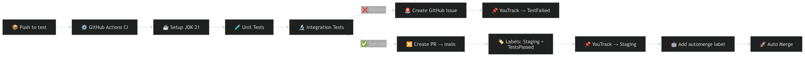

# 🚀 Event-Driven Distributed Library System

<p align="center">
  <b>Scalable Microservices Architecture using Kafka, CQRS, and Polyglot Backend</b><br/>
  <i>Designed to handle real-world workflows with eventual consistency and asynchronous processing</i>
</p>

<p align="center">
  <b>Kafka・CQRS・ポリグロット構成を用いたスケーラブルなマイクロサービスアーキテクチャ</b><br/>
  <i>結果整合性と非同期処理に基づき、実世界の業務フローを再現したシステム</i>
</p>

---

<p align="center">


</p>


## 🎬 Demo / デモ

<p align="center">
  <a href="https://github.com/damouu/distributed-library-system/issues/2#issue-4280105326">
    
  </a>
</p>

<p align="center">
  
</p>

**EN:** Click the image above to watch the full demo.  
**JP:** 上の画像をクリックするとデモ動画を視聴できます。

---

## 🧩 Architecture Overview / システム構成


---

## ✨ Key Highlights / 主な特徴

- ⚡ Event-driven architecture powered by Apache Kafka  
  → Apache Kafkaを中心としたイベント駆動アーキテクチャ


- 🔄 CQRS pattern separating write and read models  
  → 書き込みと読み取りを分離するCQRSパターン


- 🧱 Polyglot microservices (Java, Node.js, PHP)  
  → Java・Node.js・PHPによるポリグロット構成


- 📦 Fully containerized ecosystem (30+ Docker services)  
  → 30以上のDockerコンテナによる完全コンテナ化


- 📊 Observability stack (Prometheus, Grafana, Jaeger)  
  → Prometheus・Grafana・Jaegerによる可観測性


- 🚀 Designed for scalability, resilience, and eventual consistency  
  → スケーラビリティ・耐障害性・結果整合性を考慮した設計

---

## 🎯 Why this project exists / なぜこのプロジェクトを作ったのか

### 🇬🇧 English

Most backend projects focus on simple CRUD operations and do not reflect the complexity of real-world systems.

This project was built to go beyond that.

The goal is to explore how modern distributed systems are designed in production environments:
handling asynchronous workflows, ensuring eventual consistency, and decoupling services through event-driven
architecture.

Instead of relying on a monolithic design, this system models a real business domain (library management) using
microservices,
where each service owns its data and communicates through Kafka events.

It also demonstrates how architectural patterns such as CQRS can improve scalability and performance by separating write
and read concerns.

This project reflects my interest in designing reliable, scalable backend systems and my willingness to go deeper than
standard application development.


---

### 🇯🇵 日本語

多くのバックエンドプロジェクトはシンプルなCRUD処理にとどまり、実際のシステムの複雑さを十分に表現していません。

本プロジェクトは、それを超えることを目的として設計しました。

実務レベルの分散システムにおいて重要となる、
非同期処理、結果整合性、そしてイベント駆動アーキテクチャによる疎結合な設計を実現しています。

モノリシックな構成ではなく、図書館という実在する業務ドメインをマイクロサービスとして分割し、
各サービスが独立してデータを管理し、Kafkaを通じてイベントベースで連携します。

また、CQRSパターンを採用することで、書き込みと読み取りの責務を分離し、
スケーラビリティとパフォーマンスの向上を図っています。

本プロジェクトは、単なるアプリケーション開発にとどまらず、
信頼性と拡張性の高いバックエンドシステム設計への関心を示すものです。

---

# Distributed Library System

KafkaとCQRSを活用した分散システムとして設計された図書館管理プラットフォーム。マイクロサービス間の疎結合とスケーラビリティを重視し、在庫・貸出・認証・通知などを独立して管理。

A distributed library system built with Kafka and CQRS, focusing on scalability, loosely coupled microservices, and
production-ready backend architecture.

## 🗺️ Project Diagram


---

### 🧠 Architecture Summary / 概要

Event-driven distributed system using Kafka and CQRS.
Decoupled microservices communicate asynchronously via an event backbone, ensuring scalability, resilience, and eventual
consistency.

KafkaとCQRSを活用したイベント駆動型分散システム。  
マイクロサービス間は非同期イベントで疎結合に連携し、スケーラビリティと耐障害性を実現。

---

### ⚙️ Key Design Decisions / 設計上のポイント

- CQRS pattern to separate read/write concerns  
  → 読み取りと書き込みを分離するCQRSを採用


- Event-driven architecture with Kafka  
  → Kafkaによるイベント駆動設計


- Polyglot microservices (Java, Node.js, PHP)  
  → ドメインごとに最適な技術スタックを選択


- API Gateway (OpenResty + Lua) for centralized routing and authentication  
  → API Gatewayによるルーティングと認証の一元化

---

### 🎯 Why this architecture? / なぜこの構成か

This architecture isolates heavy processing (analytics, notifications) from user-facing services, ensuring low latency
and high scalability.

重い処理（分析・通知）を分離することで、ユーザー向けサービスの低遅延と高スケーラビリティを実現。

Inspired by real-world distributed systems used in fintech and banking environments.

金融・Fintechシステムの設計思想を参考に構築。

---

### 🧩 System Architecture / システム構成

#### 1. Frontend & Routing Layer / フロントエンド・ルーティング層

- Frontend App (Vue.js)  
  → Provides UI and user experience  
  → UIとユーザー体験を提供


- API Gateway (OpenResty + Lua)  
  → Single entry point with routing, authentication, and filtering  
  → 認証・ルーティング・フィルタリングを担当する単一エントリーポイント

---

#### 2. Event Producers (Command Side) / コマンドサイド（書き込み）

- Borrow Service (Spring Boot)  
  → Handles borrow/return logic  
  → 貸出・返却ロジックを管理


- Auth Service (Laravel)  
  → Handles authentication and user events  
  → 認証およびユーザーイベントを管理

➡️ These services publish events to Kafka instead of directly writing to other services.

➡️ 他サービスへ直接書き込まず、Kafkaへイベントを発行

---

#### 3. Event Backbone / イベント基盤

- Kafka Cluster (KRaft Mode)  
  → Central event bus enabling asynchronous communication  
  → 非同期通信を実現する中枢イベントバス


- Ensures event persistence, replayability, and eventual consistency  
  → イベントの永続化・再処理・結果整合性を保証

---

#### 4. Consumers & Services (Query Side) / クエリ・分析サイド

- Records Service  
  → CQRS read model for fast queries  
  → 高速参照用のCQRSリードモデル


- Inventory Service  
  → Manages stock updates from events  
  → イベントベースで在庫を更新


- Analytics Service  
  → Processes events for rankings and analytics  
  → 分析・ランキング処理を担当


- MemberCard Service  
  → Handles user membership data  
  → 会員情報を管理


- Comments Service (Node.js)  
  → Handles user-generated content  
  → コメント管理

---

#### 5. Notification Workers / 通知ワーカー

- Notification Workers (Laravel)  
  → Consume events and send notifications asynchronously  
  → イベントを受信し非同期で通知を送信


- Prevents performance impact on core services  
  → コアサービスのパフォーマンス低下を防止

---

## 🔗 Services Overview / サービス一覧

- [library-app-ui](https://github.com/damouu/library-app-ui)  
  → Frontend application (Vue.js) interacting with backend services via API Gateway  
  → API Gatewayを通じてバックエンドと連携するフロントエンドアプリケーション（Vue.js）


- [library-app-auth](https://github.com/damouu/library-app-auth)  
  → Authentication & authorization service (Laravel, JWT, Redis cache)  
  → 認証・認可サービス（Laravel、JWT、Redisキャッシュ）


- [library-app-catalogue](https://github.com/damouu/library-app-catalogue)  
  → Book catalogue service (Spring Boot, PostgreSQL)  
  → 書籍カタログ管理サービス（Spring Boot、PostgreSQL）


- [library-app-comments](https://github.com/damouu/library-app-comments)  
  → Comments service (Node.js, MongoDB)  
  → コメント管理サービス（Node.js、MongoDB）


- [library-app-records](https://github.com/damouu/library-app-records)  
  → Read model service (CQRS) for user borrowing history  
  → ユーザー貸出履歴の参照用サービス（CQRSリードモデル）


- [library-app-borrow](https://github.com/damouu/library-app-borrow)  
  → Core business service handling borrow/return logic (Spring Boot, Kafka producer)  
  → 貸出・返却ロジックを担当するコアサービス（Spring Boot、Kafkaプロデューサー）


- [library-app-inventory](https://github.com/damouu/library-app-inventory)  
  → Inventory management service (Kafka consumer, stock updates)  
  → 在庫管理サービス（Kafkaコンシューマー、在庫更新処理）


- [library-app-analytics](https://github.com/damouu/library-app-analytics)  
  → Analytics & ranking service (event-driven processing)  
  → 分析・ランキングサービス（イベント駆動処理）


- [library-app-membercard](https://github.com/damouu/library-app-membercard)  
  → Membership & user card management service  
  → 会員・ユーザーカード管理サービス


- [library-app-notification](https://github.com/damouu/library-app-notification)  
  → Notification service (Kafka consumers, email dispatch)  
  → 通知サービス（Kafkaコンシューマー、メール送信）

---

### 🧱 Docker Compose Overview / 構成概要

The `docker-compose.yml` orchestrates the entire distributed system by defining all services, dependencies, and
infrastructure components.

この `docker-compose.yml` は、すべてのサービス・依存関係・インフラ構成を統合管理しています。

---

### 🔑 Key Components / 主要構成

- **Kafka (KRaft mode)**  
  → Central event streaming platform for asynchronous communication  
  → 非同期通信を担うイベント基盤


- **Microservices**  
  → Independent services (Spring Boot, Node.js, Laravel) communicating via events  
  → イベントを通じて連携するマイクロサービス群


- **Databases**  
  → PostgreSQL, MongoDB, Redis (per-service data ownership)  
  → サービスごとに分離されたデータ管理


- **API Gateway (OpenResty)**  
  → Centralized routing and authentication  
  → ルーティングと認証の一元化


- **Observability Stack**  
  → Prometheus, Grafana, Jaeger for monitoring and tracing  
  → 監視・トレーシング基盤

---

### ⚙️ Design Choices / 設計ポイント

- Each service has its own database (data isolation)  
  → サービスごとに独立したデータベース


- Kafka used as the event backbone (decoupling)  
  → Kafkaによる疎結合な通信


- Healthchecks & dependencies ensure proper startup order  
  → ヘルスチェックによる起動順制御


- Worker-based architecture for async tasks (notifications)  
  → 非同期処理をワーカーで分離

---

This setup reflects a production-like distributed system designed for scalability and resilience.

スケーラビリティと耐障害性を考慮した実務レベルの構成です。

---

## 🐳 Run Locally / ローカル実行

You can run the entire distributed system locally using Docker Compose.  
This setup simulates a production-like environment with Kafka, databases, and all microservices.

Docker Composeを使用して、Kafka・データベース・各マイクロサービスを含む分散システム全体をローカルで起動できます。実務に近い構成を再現しています。

---

### 🚀 Quick Start

```bash
git clone https://github.com/damouu/distributed-library-system.git
cd distributed-library-system
docker-compose up --build

```

---

## 🔄 Borrow Flow / 貸出処理フロー

This diagram illustrates the business flow when a user borrows a book.  
The request is processed by the Borrow Service, which validates the operation and publishes an event to Kafka.  
Other services then react asynchronously to update their respective domains.

この図は、ユーザーが本を借りる際の業務フローを示しています。  
リクエストはBorrow Serviceで処理され、検証後にKafkaへイベントが発行されます。  
その後、各サービスが非同期でイベントを処理し、それぞれのデータを更新します。


---

## ⏳ Eventual Consistency Flow / 結果整合性フロー

This diagram illustrates how the system achieves eventual consistency using an event-driven architecture.  
When a user performs a borrow action, the system responds immediately while propagating changes asynchronously across
multiple services via Kafka.

この図は、イベント駆動アーキテクチャにおける結果整合性（Eventual Consistency）の仕組みを示しています。  
ユーザーが貸出操作を行うと、システムは即時にレスポンスを返し、その後Kafkaを通じて各サービスに非同期で変更が伝播されます。




---

### 3. CI/CD Pipeline / 継続的インテグレーション・デリバリー

Each microservice implements its own CI/CD pipeline using GitHub Actions, ensuring consistency across a polyglot
architecture (Java, Node.js, PHP).

各マイクロサービスはGitHub ActionsによるCI/CDパイプラインを持ち、Java・Node.js・PHPのポリグロット構成でも一貫した品質を保証します。

---

#### ⚙️ Pipeline Features / パイプラインの特徴

- Automated unit and integration testing (Maven, PHPUnit, Jest)  
  → ユニットテスト・統合テストの自動実行


- Code quality enforcement (linting, validation)  
  → コード品質チェック（Lint・構文検証）


- Test coverage reporting (Codecov integration)  
  → テストカバレッジの可視化


- Secure secret injection (JWT keys, environment variables)  
  → シークレット管理（JWT鍵など）

---

#### 🧪 Test Quality / テスト品質

- Coverage tracking ensures critical business logic is tested  
  → 重要なビジネスロジックのカバレッジを確保


- Cyclomatic complexity is reduced through modular design and testable services  
  → 循環的複雑度を抑えた設計によりテスト容易性を向上


- Separation between unit and integration tests (Java services)  
  → ユニットテストと統合テストの分離

---

#### 🔄 Automation / 自動化

- Automatic Pull Request creation when tests pass  
  → テスト成功時にPRを自動作成


- Automatic issue creation when tests fail  
  → テスト失敗時にIssueを自動生成


- Integration with YouTrack for workflow management  
  → YouTrackとの連携によるタスク管理

---

#### 🚀 Continuous Delivery / 継続的デリバリー

- Docker images are automatically built and pushed  
  → Dockerイメージの自動ビルド・Push


- Each image is tagged using the Git commit SHA  
  → 各イメージはGitのコミットSHAでタグ付け


- The pipeline checks out the exact commit before building  
  → ビルド前に対象コミットを明示的にチェックアウト


- Enables reproducible builds and precise version tracking  
  → 再現可能なビルドと正確なバージョン管理を実現


- Allows safe rollback to any previous version in production  
  → 本番環境での安全なロールバックが可能

This approach ensures traceability between source code and deployed artifacts, a key requirement in production-grade
systems.

この仕組みにより、ソースコードとデプロイされた成果物のトレーサビリティが保証され、本番環境において重要な要件を満たします。

---

### 🎯 Outcome / 成果

This CI/CD system ensures high code quality, fast feedback loops, and production-ready builds across all services.

このCI/CDにより、高品質なコード、迅速なフィードバック、本番対応可能なビルドを実現しています。

---

## 🔍 Distributed Tracing with Jaeger / Jaegerによる分散トレーシング

To ensure full transparency and reliability in a distributed environment, the system implements OpenTelemetry-based
distributed tracing. This enables full visibility into the lifecycle of a request across multiple microservices and the
Kafka event backbone.

分散環境における透明性と信頼性を確保するため、本システムではOpenTelemetryによる分散トレーシングを実装しています。これにより、複数のマイクロサービスやKafkaイベント基盤をまたぐリクエストのライフサイクル全体を可視化できます。

---

### 🔍 Jaeger Trace — Borrow Request / Jaegerトレース：貸出リクエスト



This trace illustrates the end-to-end lifecycle of a borrow request across the distributed system, including synchronous
processing and asynchronous event propagation.

このトレースは、貸出リクエストがシステム全体をどのように流れるか（同期処理および非同期イベント伝播）を示しています。

## 📦 Event Payload — Borrow Domain / イベントペイロード（貸出ドメイン）

This section presents the actual event payload published by the **Borrow Service** to Kafka when a user borrows books.  
It demonstrates how the system applies a domain-driven and event-driven design to achieve scalability and loose
coupling.

このセクションでは、ユーザーが本を借りた際に **Borrow Service**
からKafkaへ発行される実際のイベントペイロードを紹介します。  
ドメイン駆動設計とイベント駆動アーキテクチャにより、スケーラビリティと疎結合を実現しています。

---

### 📨 Sample Event Payload

```json
{
  "metadata": {
    "timestamp": "2026-04-17",
    "memberCardUUID": "64575088-afaf-4684-9b9f-37f77e2a6214",
    "source_service": "library-app-borrow-v1",
    "event_type": "LIBRARY_BORROWED",
    "event_uuid": "800db7e6-0394-4b2d-86c2-28337368fa91"
  },
  "data": {
    "notification_data": {
      "borrow_uuid": "800db7e6-0394-4b2d-86c2-28337368fa91",
      "borrow_start_date": "2026-04-17",
      "borrow_end_date": "2026-05-01",
      "chapters": [
        {
          "chapter_title": "チェンソーマン",
          "chapter_number": 1,
          "chapter_uuid": "a93038dc-5aee-494c-ad0c-6795c75567d0",
          "chapter_second_title": "チェンソーマン",
          "chapter_cover_url": "https://m.media-amazon.com/images/I/71YNo-m85oL._SL1200_.jpg"
        }
      ]
    },
    "inventory_data": {
      "books": [
        {
          "book_uuid": "9e583a0b-caba-416e-8a0f-b1da2db495b1"
        }
      ]
    }
  }
}

```

---

## 📌 Case Study: Borrow Action / ケーススタディ：貸出処理

The following trace (ID: `a982a5638069bbe89c869698dfea64b8`) illustrates a complete borrow request lifecycle.

以下のトレース（ID: `a982a5638069bbe89c869698dfea64b8`）は、貸出処理の一連の流れを示しています。



---

### 🇬🇧 English Analysis

#### ⚡ Synchronous Fast Path (Critical Path)

The **Borrow Service** processes the initial request in **543ms**, including:

- Input validation
- Membership verification
- Database transaction (persisting the borrow record)
- Event publication to Kafka

The user receives a success response immediately after this stage.

---

#### 🔄 Asynchronous Propagation (Event-Driven)

Once the `BorrowEvent` is published, downstream services consume it independently (**fan-out pattern**):

- **Inventory & Records Services**  
  → Update stock and user history (~140ms)

- **Analytics Service**  
  → Recomputes rankings asynchronously (~133ms)

- **Notification Service**  
  → Sends confirmation email (~264ms, heaviest task)

These operations are fully decoupled from the user request and do not impact perceived latency.

---

#### ⏳ Time to Eventual Consistency

The system reaches a fully consistent state in **~965ms**, without blocking the user interface.

---

### 🇯🇵 日本語による分析

#### ⚡ 同期的な高速パス（クリティカルパス）

Borrow Serviceはリクエストを**543ms**で処理し、以下を実行します：

- 入力バリデーション
- 会員ステータス確認
- データベースへのトランザクション保存
- Kafkaへのイベント発行

この段階でユーザーには即座に成功レスポンスが返されます。

---

#### 🔄 非同期伝播（イベント駆動）

`BorrowEvent`発行後、各サービスが独立してイベントを処理します（ファンアウトパターン）：

- **Inventory / Recordsサービス**  
  → 在庫と履歴を更新（約140ms）

- **Analyticsサービス**  
  → ランキングを非同期で再計算（約133ms）

- **Notificationサービス**  
  → メール通知を送信（約264ms・最も重い処理）

これらの処理はユーザーの体感レイテンシに影響しません。

---

#### ⏳ 結果整合性までの時間

システム全体は約**965ms**で整合性の取れた状態に到達します。ユーザー操作は一切ブロックされません。

---

### 💡 Engineering Insights / エンジニアリング考察

- The system follows a **"write fast, propagate later"** strategy  
  → 「即時書き込み・後続伝播」戦略を採用

- Heavy operations are isolated from the critical path  
  → 重い処理はクリティカルパスから分離

- Event-driven fan-out enables scalable and decoupled processing  
  → イベント駆動のファンアウトによりスケーラブルな処理を実現

- Asynchronous design guarantees responsiveness under load  
  → 非同期設計により高負荷でも応答性を維持

---

## 🖥️ Frontend Showcase / フロントエンド画面

### 📊 Ranking System / ランキング機能

<p align="center">
  
</p>

---

### 🇬🇧 English

This ranking section displays the most popular books based on borrowing activity.

The ranking is **not calculated in real-time by the frontend or the borrow service**.

Instead, it is powered by the **Analytics Service**, which follows an event-driven approach:

- Each borrow action emits a `BorrowEvent` to Kafka
- The Analytics Service consumes these events asynchronously
- It aggregates and updates ranking data independently

When the frontend requests ranking data, it simply queries the Analytics Service.

This design ensures:

- Decoupling between core business logic (borrow service) and analytics
- No additional load on the borrow service
- Fast read performance for the frontend
- Scalability for heavy computations

---

### 🇯🇵 日本語

このランキング画面は、ユーザーの貸出履歴に基づいて人気の書籍を表示します。

ランキングはフロントエンドや貸出サービスでリアルタイムに計算されるわけではありません。

代わりに、イベント駆動型の **Analytics Service** によって処理されます：

- 貸出が行われるたびに `BorrowEvent` がKafkaに発行される
- Analytics Serviceがこれらのイベントを非同期でコンシュームする
- ランキングデータを集計・更新する

フロントエンドはランキング取得時にAnalytics Serviceへ問い合わせるだけです。

この設計により：

- 貸出サービスと分析処理の疎結合を実現
- 貸出サービスへの負荷を増やさない
- フロントエンドは高速にデータ取得が可能
- 重い計算処理をスケーラブルに分離できる

---

## 🔍 Observability – User Registration Trace / ユーザー登録トレース

### 📸 Jaeger Distributed Trace

<p align="center">
  
</p>

---

### 🇬🇧 English

This trace represents the full distributed flow triggered when a user registers an account.

The request goes through multiple services and demonstrates how synchronous and asynchronous operations are combined in
an event-driven architecture.

#### 🧩 Flow Breakdown

1. **Auth Service (PHP / Laravel)**

- Validates incoming user data
- Hashes and salts the password securely before storing it
- Persists the user in the database
- Generates a JWT for authentication
- Publishes a `UserCreatedEvent` to Kafka

2. **Kafka Event Propagation**

- The event is sent to a Kafka topic (`auth-create-topic`)
- Includes user metadata such as:
    - user UUID
    - email
    - username
    - timestamps

3. **MemberCard Service (Java / Spring Boot)**

- Consumes the event asynchronously
- Generates a unique **member card UUID**
- Associates it with the user (UUID + email)
- Persists the member card in its own database

4. **Notification Service (PHP / Laravel)**

- Consumes the same event in parallel
- Sends a registration confirmation email

---

#### ⚡ Key Architectural Insights

- Event-driven communication via Kafka enables **loose coupling** between services
- Parallel consumers allow independent scaling of features (membercard, notifications)
- The Auth service remains focused on core responsibilities (authentication & identity)
- Distributed tracing with Jaeger provides full visibility across services

---

### 📦 Kafka Event Payload

<p align="center">
  
</p>

This payload is produced by the Auth service and consumed by downstream services.

---

### 🇯🇵 日本語

このトレースは、ユーザー登録時に発生する分散システム全体の処理フローを示しています。

リクエストは複数のサービスを経由し、同期処理と非同期イベント処理がどのように連携しているかを可視化しています。

#### 🧩 処理の流れ

1. **Auth Service（PHP / Laravel）**

- ユーザーデータのバリデーション
- パスワードをハッシュ化・ソルト付与して安全に保存
- ユーザー情報をデータベースに永続化
- JWTトークンを生成
- Kafkaへ `UserCreatedEvent` を発行

2. **Kafkaイベント伝播**

- イベントは `auth-create-topic` に送信される
- 以下の情報を含む：
    - ユーザーUUID
    - メールアドレス
    - ユーザー名
    - タイムスタンプ

3. **MemberCard Service（Java / Spring Boot）**

- イベントを非同期でコンシューム
- 会員カード用のUUIDを生成
- ユーザー情報（UUID・メール）と紐付け
- データベースに保存

4. **Notification Service（PHP / Laravel）**

- 同じイベントを並列でコンシューム
- 登録完了メールを送信

---

#### ⚡ アーキテクチャ上のポイント

- Kafkaによるイベント駆動でサービス間の疎結合を実現
- 並列コンシューマーにより機能ごとに独立してスケール可能
- Authサービスは認証・ユーザー管理に責務を集中
- Jaegerによる分散トレーシングでシステム全体の可視性を確保

---

## 📊 Monitoring — Prometheus / モニタリング（Prometheus）

This project integrates **Prometheus** to monitor the health and availability of all microservices in real time.

本プロジェクトでは、**Prometheus**を使用して、すべてのマイクロサービスの状態と可用性をリアルタイムで監視しています。

---

### 🖥️ Services Health Overview



---

### 🇬🇧 English

The screenshot above shows the **Prometheus Targets dashboard**, where each service exposes a `/metrics` endpoint.

#### ✅ Observability Features

- **Health checks per service**  
  Each microservice exposes metrics via HTTP endpoints (Spring Boot Actuator, Node.js, Laravel, etc.)

- **Centralized monitoring**  
  Prometheus scrapes all services and aggregates their status in one place

- **Service availability tracking**  
  Each target is marked as:
    - `UP` → Service is healthy and reachable
    - `DOWN` → Service is unavailable or failing

---

#### 🧩 Services Monitored

- `auth`
- `borrow`
- `catalogue`
- `inventory`
- `analytics`
- `records`
- `comments`
- `membercard`

👉 All services are independently monitored, reinforcing the distributed nature of the system.

---

#### 🚀 Why it matters

- Detect failures instantly
- Ensure system reliability
- Enable future alerting (Alertmanager integration)
- Provide metrics for performance analysis

---

### 🇯🇵 日本語

上記のスクリーンショットは、**Prometheus Targets画面**を示しており、各サービスの状態を確認できます。

---

#### ✅ 可観測性の特徴

- **サービスごとのヘルスチェック**  
  各マイクロサービスは `/metrics` エンドポイントを公開（Spring Boot Actuator / Node.js / Laravel など）

- **集中監視**  
  Prometheusがすべてのサービスをスクレイピングし、状態を一元管理

- **サービス可用性の可視化**  
  各サービスは以下の状態で表示されます：
    - `UP` → 正常稼働
    - `DOWN` → 障害発生または未到達

---

#### 🧩 監視対象サービス

- `auth`
- `borrow`
- `catalogue`
- `inventory`
- `analytics`
- `records`
- `comments`
- `membercard`

👉 各サービスは独立して監視され、分散システムの信頼性を向上させます。

---

#### 🚀 この仕組みの重要性

- 障害の即時検知
- システムの信頼性向上
- 将来的なアラート連携（Alertmanager）
- パフォーマンス分析のための基盤

---

## 🔍 Distributed Tracing — Jaeger / 分散トレーシング（Jaeger）

This project integrates **Jaeger** to provide end-to-end distributed tracing across all microservices.

本プロジェクトでは、**Jaeger**を使用して、すべてのマイクロサービスにおける分散トレーシングを実現しています。

---

### 🗺️ System Architecture View (Generated from Traces)



---

### 🇬🇧 English

The diagram above is automatically generated by Jaeger based on real trace data.  
It visualizes how services interact with each other once they start producing and consuming Kafka events.

---

### 🔄 How it works

- Each service is instrumented with tracing (OpenTelemetry / Jaeger client)
- When a request is processed, a **trace** is created
- Each operation becomes a **span**
- Context is propagated across services (HTTP + Kafka)

👉 This allows Jaeger to reconstruct the full system interaction graph.

---

### 🧩 Observed Architecture

From the diagram, we can clearly identify:

- **Auth Service**
  → Produces user-related events consumed by:
    - `membercard`
    - `notification`

- **Borrow Service**
  → Publishes borrow events consumed by:
    - `inventory`
    - `records`
    - `analytics`
    - `notification`

👉 This highlights a **fan-out event-driven architecture**, where one producer triggers multiple independent consumers.

---

### 🚀 Why it matters

- Visualize real service dependencies (not theoretical diagrams)
- Debug cross-service issues efficiently
- Understand event propagation paths
- Validate architecture decisions (CQRS, event-driven)

---

## 🇯🇵 日本語

上記の図は、Jaegerによって実際のトレースデータから自動生成されたシステム構成図です。  
Kafkaイベントの発行・購読によるサービス間の関係を可視化しています。

---

### 🔄 仕組み

- 各サービスにトレーシング（OpenTelemetry / Jaeger）を組み込み
- リクエストごとに**トレース（trace）**を生成
- 各処理は**スパン（span）**として記録
- コンテキストはサービス間で伝播（HTTP / Kafka）

👉 これにより、分散システム全体のフローを再構築できます。

---

### 🧩 可視化された構成

図から以下の構造が確認できます：

- **Authサービス**
  → ユーザーイベントを発行し、以下が消費：
    - `membercard`
    - `notification`

- **Borrowサービス**
  → 貸出イベントを発行し、以下が消費：
    - `inventory`
    - `records`
    - `analytics`
    - `notification`

👉 これは、1つのイベントが複数サービスに伝播する  
**イベント駆動型ファンアウト構成**を示しています。

---

### 🚀 この仕組みの重要性

- 実際の依存関係を可視化（設計図ではなく実データ）
- 分散システムのデバッグが容易
- イベント伝播の理解を促進
- アーキテクチャの妥当性検証（CQRS・イベント駆動）

--- 

## ⚙️ Continuous Integration (CI) / 継続的インテグレーション



**EN:**  
Every push to the `test` branch triggers an automated validation pipeline ensuring code reliability before integration
into `main`.

**JP:**  
`test`ブランチへのPushごとに、自動検証パイプラインが実行され、`main`への統合前にコードの信頼性を保証します。

---

### 🧪 Quality Gates / 品質ゲート

**EN:**

- Executes **unit tests** and **integration tests** using JDK 21
- Ensures correctness across both isolated logic and system interactions

**JP:**

- JDK 21環境でユニットテストおよび統合テストを実行
- ロジック単体およびシステム全体の整合性を検証

---

### 🤖 Automated Project Management / プロジェクト管理の自動化

**EN:**

- On failure:
    - Automatically creates a GitHub Issue
    - Moves the corresponding YouTrack ticket to `TestFailed`

**JP:**

- テスト失敗時：
    - GitHub Issueを自動作成
    - YouTrackチケットを `TestFailed` に移動

---

### 🚀 Promotion Logic / プロモーションロジック

**EN:**

- On success:
    - Creates a Pull Request to `main`
    - Applies labels (`Staging`, `TestsPassed`)
    - Moves YouTrack ticket to `Staging`
    - Automatically merges the PR

👉 Enables a **fully automated, label-driven workflow**

**JP:**

- テスト成功時：
    - `main`へのPull Requestを自動作成
    - `Staging`・`TestsPassed`ラベルを付与
    - YouTrackチケットを `Staging` に移動
    - PRを自動マージ

👉 ラベルベースの完全自動ワークフローを実現

---

## 🚀 Continuous Deployment (CD) / 継続的デプロイ


**EN:**  
Once code is merged into `main`, the CD pipeline automatically builds and publishes a production-ready container image.

**JP:**  
コードが`main`にマージされると、CDパイプラインが本番用コンテナのビルドと配布を自動実行します。

---

### 📦 Immutable Releases / イミュータブルなリリース

**EN:**

- Retrieves the exact Git SHA from artifacts
- Tags the Docker image with this SHA
- Ensures **1:1 traceability between code and deployment artifact**

**JP:**

- ArtifactからGit SHAを取得
- DockerイメージにSHAタグを付与
- コードとデプロイ成果物の**完全な対応関係**を保証

---

### 📤 Registry Sync / レジストリ連携

**EN:**

- Builds and pushes the Docker image to Docker Hub
- Produces a versioned, production-ready artifact

**JP:**

- DockerイメージをビルドしDocker HubへPush
- バージョン管理された本番用アーティファクトを生成

---

### ✅ Finalization / 完了処理

**EN:**

- Automatically moves the YouTrack ticket to `Done`
- Closes the delivery loop

👉 Guarantees **end-to-end automation from commit to delivery**

**JP:**

- YouTrackチケットを `Done` に移動
- デリバリープロセスを完結

👉 コミットからデプロイまでの完全自動化を実現

---

## 🧠 Engineering Takeaways / 学び

EN:

- Designing for eventual consistency changes how you think about data
- Event-driven systems require strong observability
- Decoupling services improves scalability but increases complexity

JP:

- 結果整合性を前提とした設計はデータ設計の考え方を大きく変える
- イベント駆動システムでは可観測性が不可欠
- サービスの疎結合はスケーラビリティを向上させるが複雑性も増加する

---

### 🚀 Summary

This project demonstrates a production-inspired distributed system with real-world architectural patterns such as CQRS,
event-driven design, and microservices.

本プロジェクトはCQRS、イベント駆動設計、マイクロサービスといった実務レベルのアーキテクチャを再現しています。

---

## 👤 Author / 作成者

<p align="center">

Built as a portfolio project to demonstrate modern backend engineering practices  
モダンなバックエンド設計を実証するためのポートフォリオプロジェクト

<br/>

Made with ❤️ by <b>Damou</b>

<a href="https://github.com/damouu">GitHub</a> •
<a href="https://www.linkedin.com/">LinkedIn</a>

<br/>

JLPT N1 | Backend & Platform Engineer

</p>
