# 🚀 Distributed Library System

### An Event-Driven, Domain-Driven and Cloud-Native Architecture

<p align="center">
  <b>Production-inspired Distributed Architecture using Domain Events, Event-Carried State Transfer, CQRS and Kubernetes</b><br/>
  <i>Designed around Domain-Driven Design to achieve loose coupling, eventual consistency, and independently scalable microservices</i>
</p>

<p align="center">
  <b>DDD・Event-Carried State Transfer・CQRS・Kubernetesを活用した実務志向の分散アーキテクチャ</b><br/>
  <i>疎結合・結果整合性・高い拡張性を実現するために設計されたイベント駆動型マイクロサービス</i>
</p>

---

<p align="center">


</p>

## 🎬 System Demo / システムデモ

**EN:** Real-time distributed workflow: borrow → Kafka → async processing → analytics ranking update

**JP:** 分散システムのリアルタイム処理：貸出 → Kafka → 非同期処理 → ランキング更新

<p align="center">
  <a href="https://github.com/damouu/distributed-library-system/issues/2#issue-4280105326">
    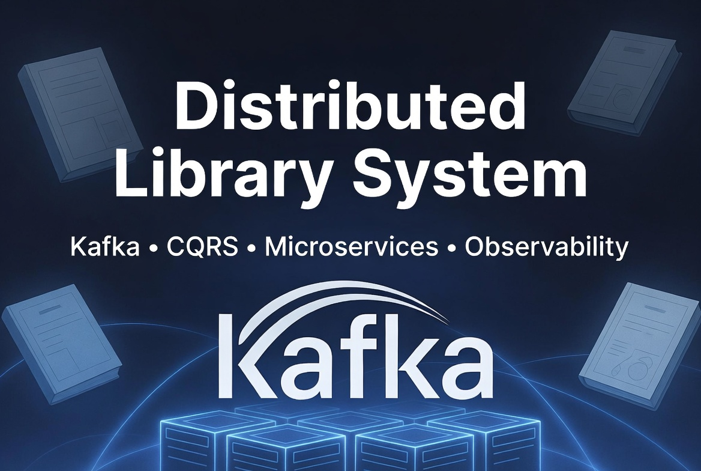
  </a>
</p>

<p align="center">
  
</p>

**EN:** Click the image above to watch the full demo.  
**JP:** 上の画像をクリックするとデモ動画を視聴できます。

---

## 🏛️ Architecture Overview / システム構成

**EN:** The following diagram illustrates the overall system architecture, including bounded contexts, asynchronous
event flows, external managed services, and the Kubernetes deployment topology.

**JP:** 以下の図は、境界づけられたコンテキスト（Bounded
Context）、非同期イベントフロー、外部マネージドサービス、およびKubernetesのデプロイメントトポロジを含む、システム全体のアーキテクチャを示しています。

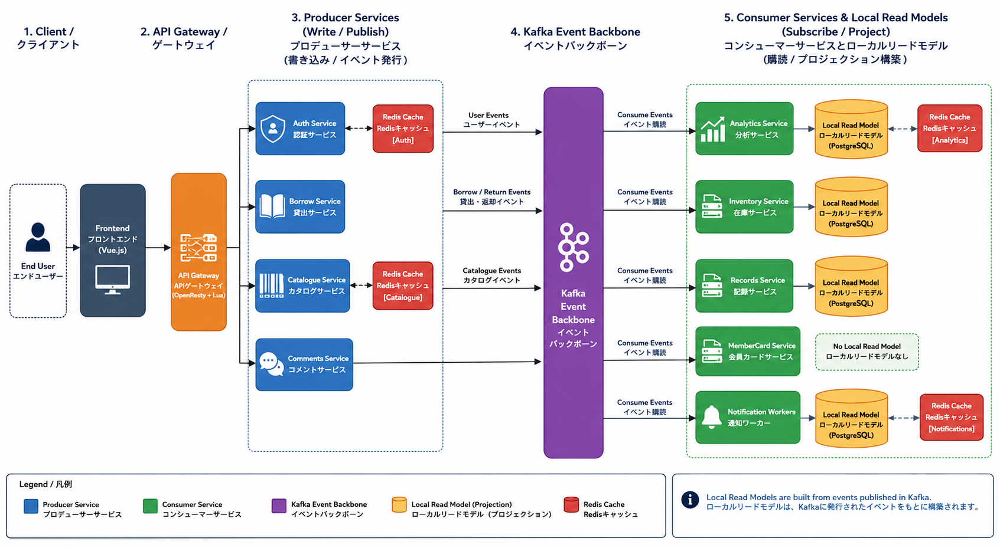

---

## 💡 Why Version 2? / なぜ Version 2 を作ったのか

### 🇬🇧 English

Version 1 successfully demonstrated an event-driven architecture using Apache Kafka, CQRS, and asynchronous
communication between microservices. It provided a solid foundation for modeling a distributed library system and
validating the overall architecture.

However, as the system evolved, several architectural limitations became apparent.

The most significant issue was that event payloads were designed around the needs of downstream consumers rather than
around the Borrow domain itself. Events contained service-specific structures such as `notification_data` and
`inventory_data`, meaning the Borrow service had explicit knowledge of how other services consumed its events.

This approach created unnecessary coupling between bounded contexts. Every time a new consumer required additional
information, or an existing consumer changed its requirements, the Borrow service had to be modified. As a result, a
single business event became responsible for satisfying multiple independent services.

Version 2 was created to address these architectural limitations.

The event model was redesigned following **Domain-Driven Design (DDD)** principles and the **Event-Carried State
Transfer (ECST)** pattern. Instead of publishing consumer-oriented payloads, each producer now emits only the business
facts belonging to its own domain.

Consumers are now fully responsible for interpreting events and building their own **Local Projections** optimized for
their specific use cases. This removes producer knowledge of downstream services, significantly reduces coupling, and
allows new consumers to subscribe to existing events without requiring changes to the event producer.

Another important evolution was extending event production beyond the Borrow and Auth services. In Version 2, additional
bounded contexts such as the Catalogue service also became Kafka event producers, allowing each domain to publish its
own business events independently.

Beyond the communication model, Version 2 also modernizes the deployment architecture by moving from a Docker Compose
environment to Kubernetes, externalizing databases to managed cloud services, and improving observability through
OpenTelemetry, Jaeger, Prometheus, and Grafana.

Rather than introducing new technologies for their own sake, Version 2 represents an architectural refinement driven by
lessons learned while building Version 1. The objective was to move closer to production-grade distributed system design
by improving domain boundaries, reducing coupling, and increasing long-term maintainability.

---

### 🇯🇵 日本語

Version 1では、Apache Kafka・CQRS・非同期通信を活用したイベント駆動型アーキテクチャを実装し、分散型図書館システムの基盤を構築しました。

しかし、システムの拡張に伴い、いくつかの設計上の課題が明らかになりました。

最も大きな課題は、イベントペイロードが業務ドメインではなく、各コンシューマーの都合に合わせて設計されていたことです。
`notification_data` や `inventory_data` のようなサービス固有のデータを含んでいたため、Borrowサービスが他サービスの内部構造を知っている状態になっていました。

その結果、境界づけられたコンテキスト（Bounded
Context）間の結合度が高くなり、新しいコンシューマーを追加したり既存サービスの要件が変わるたびに、Borrowサービス側のイベント定義を変更する必要がありました。

Version 2では、この課題を解決するためにイベント設計を全面的に見直しました。

Domain-Driven Design（DDD）と **Event-Carried State Transfer（ECST）** の考え方を採用し、各サービスは自分のドメインに属するビジネス上の事実のみをイベントとして公開します。

イベントを受け取る各サービスは、それぞれの用途に最適化された **Local Projection**
を独自に構築するようになりました。これにより、イベント発行側はコンシューマーを意識する必要がなくなり、疎結合で拡張性の高いアーキテクチャを実現しています。

さらに、Version 2ではBorrowやAuthだけでなく、CatalogueサービスもKafkaイベントのProducerとなり、各Bounded
Contextが自身のドメインイベントを独立して発行する構成へ進化しました。

また、インフラ面でもDocker
Compose中心の構成からKubernetesへ移行し、データベースをマネージドクラウドサービスへ外部化するとともに、OpenTelemetry・Jaeger・Prometheus・Grafanaによる可観測性も大幅に強化しました。

Version 2は単なる機能追加ではなく、Version 1で得られた経験をもとに、ドメイン境界の明確化、サービス間結合の削減、保守性・拡張性の向上を目的としてアーキテクチャ全体を再設計したものです。

---

## 🔄 Evolution: Version 1 → Version 2

Version 2 is not a complete rewrite of the project, but an architectural evolution driven by lessons learned while
building Version 1. Each change was introduced to improve maintainability, scalability, and adherence to Domain-Driven
Design (DDD) principles.

### 1️⃣ Why the redesign?

| Version 1            | Version 2                                          |
|:---------------------|:---------------------------------------------------|
| Working architecture | Production-oriented architecture                   |
| Proof of concept     | Domain-oriented redesign                           |
| Event-driven         | Event-driven + ECST (Event-Carried State Transfer) |
| Functional           | Better maintainability                             |

### 2️⃣ Architectural differences

| Area                   | Version 1         | Version 2               |
|:-----------------------|:------------------|:------------------------|
| **Communication**      | Kafka Events      | Kafka Domain Events     |
| **Event Design**       | Consumer-oriented | Domain-oriented         |
| **Producer Knowledge** | Knows consumers   | Consumer agnostic       |
| **Data Ownership**     | Partially shared  | Strict bounded contexts |
| **Deployment**         | Docker Compose    | Kubernetes              |
| **Databases**          | Local containers  | Managed cloud databases |
| **Observability**      | Basic             | OpenTelemetry + Jaeger  |

**Version 1 (Coupled Architecture)**

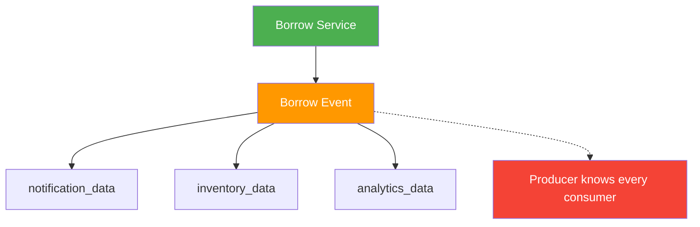
```mermaid

flowchart TD
    B["Borrow Service"]
    E["Borrow Event"]
    ND["notification_data"]
    ID["inventory_data"]
    AD["analytics_data"]
    B --> E
    E --> ND
    E --> ID
    E --> AD
    C["Producer knows every consumer"]
    E -.-> C
    style B fill: #4CAF50, color: #fff
    style E fill: #FF9800, color: #fff
    style C fill: #F44336, color: #fff
```

**Version 2 (Decoupled & Event-Driven)**

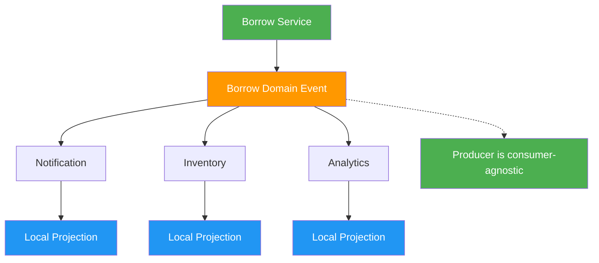
```mermaid

flowchart TD
    B["Borrow Service"]
    E["Borrow Domain Event"]
    N["Notification"]
    I["Inventory"]
    A["Analytics"]
    NP["Local Projection"]
    IP["Local Projection"]
    AP["Local Projection"]
    B --> E
    E --> N
    E --> I
    E --> A
    N --> NP
    I --> IP
    A --> AP
    C["Producer is consumer-agnostic"]
    E -.-> C
    style B fill: #4CAF50, color: #fff
    style E fill: #FF9800, color: #fff
    style NP fill: #2196F3, color: #fff
    style IP fill: #2196F3, color: #fff
    style AP fill: #2196F3, color: #fff
    style C fill: #4CAF50, color: #fff
```

### 3️⃣ Event Payload Evolution

**Version 1 Payload (Consumer-Oriented Event)**

```json
{
  "metadata": {
    "timestamp": "2026-04-17",
    "memberCardUUID": "64575088-afaf-4684-9b9f-37f77e2a6214",
    "source_service": "library-app-borrow-v1",
    "event_type": "LIBRARY_BORROWED",
    "event_uuid": "800db7e6-0394-4b2d-86c2-28337368fa91"
  },
  "data": {
    "notification_data": {
      "borrow_uuid": "800db7e6-0394-4b2d-86c2-28337368fa91",
      "borrow_start_date": "2026-04-17",
      "borrow_end_date": "2026-05-01",
      "chapters": [
        {
          "chapter_title": "チェンソーマン",
          "chapter_number": 1,
          "chapter_uuid": "a93038dc-5aee-494c-ad0c-6795c75567d0",
          "chapter_second_title": "チェンソーマン",
          "chapter_cover_url": "https://m.media-amazon.com/images/I/71YNo-m85oL._SL1200_.jpg"
        }
      ]
    },
    "inventory_data": {
      "books": [
        {
          "book_uuid": "9e583a0b-caba-416e-8a0f-b1da2db495b1"
        }
      ]
    }
  }
}

```

Problems:

The producer knew every consumer and their specific data needs.

The payload grew over time.

Events were not reusable by new, unknown services.

Violated bounded contexts (e.g., Book Titles inside a Borrow event).

**Version 2 Payload (Domain Event)**

```json
{
  "metadata": {
    "timestamp": "2026-06-10T14:36:05.424117357",
    "source_service": "library-app-borrow-v1",
    "event_type": "LIBRARY_BORROWED",
    "event_uuid": "58ae2d2f-abe0-4b73-8921-f7c15b0c322c"
  },
  "data": {
    "member_card_uuid": "9d95a26b-6d6c-4dea-b25b-1ffb8eee9d75",
    "borrow_uuid": "58ae2d2f-abe0-4b73-8921-f7c15b0c322c",
    "borrow_start_date": "2026-06-10",
    "borrow_end_date": "2026-06-24",
    "borrowed_items": [
      {
        "book_uuid": "dfb567f6-233b-4eba-8b7c-1e252a4eac17",
        "chapter_uuid": "15d4a9c8-3fa7-444e-b9a7-080658f214e4"
      },
      {
        "book_uuid": "f2327615-8f14-4192-ab0b-2b13795dbe2a",
        "chapter_uuid": "81fa2250-0b87-47b8-8e90-9643ae22a9e5"
      }
    ]
  }
}

```

Improvements:

Contains only undeniable domain facts.

Reusable by every consumer.

Follows the Event-Carried State Transfer (ECST) pattern.

The producer is completely independent and context-agnostic.

Conclusion:

The Borrow service no longer publishes specific data tailored for Notification or Inventory. It simply publishes a pure,
lightweight borrowing event.

### 4️⃣ Producers Evolution

| Producer      | Version 1 | Version 2 |
|:--------------|:----------|:----------|
| **Auth**      | ✅         | ✅         |
| **Borrow**    | ✅         | ✅         |
| **Catalogue** | ❌         | ✅         |

Version 1: Auth & Borrow

Version 2: Auth, Borrow, & Catalogue

Tomorrow: Recommendations, Payments, Invoices...

Every bounded context becomes strictly responsible for publishing the events of its own domain.

### 5️⃣ Infrastructure Evolution

| Component                 | Version 1 | Version 2 |
|:--------------------------|:----------|:----------|
| **Docker Compose**        | ✅         | ❌         |
| **Kubernetes**            | ❌         | ✅         |
| **PostgreSQL Containers** | ✅         | ❌         |
| **Neon (Managed DB)**     | ❌         | ✅         |
| **MongoDB Local**         | ✅         | ❌         |
| **MongoDB Atlas**         | ❌         | ✅         |
| **Mailpit**               | ✅         | ❌         |
| **Resend**                | ❌         | ✅         |
| **Telemetry**             | Partial   | Complete  |
| **Prometheus**            | ✅         | ✅         |
| **Jaeger**                | ✅         | ✅         |
| **Caching**               | ❌         | Specific  |

Version 2 focuses not only on improving application architecture but also on aligning the deployment and operational
model with production-oriented distributed systems. Kubernetes, managed databases, centralized observability, and
domain-driven event communication collectively move the project closer to real-world backend architectures.

---

## 🏛️ ☸️ Kubernetes Cluster Architecture / システム構成

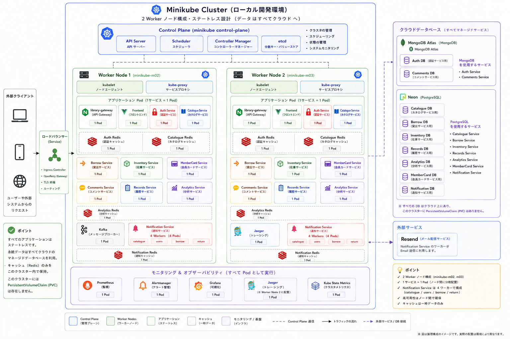

### 🇬🇧 English

Version 2 migrates from a Docker Compose deployment to a cloud-native Kubernetes architecture designed for horizontal
scalability and operational resilience.

#### ⚡ Key Architectural Highlights

* **100% Stateless Design (Zero PVCs):**
  All application pods are completely stateless. There are no `PersistentVolumeClaims` (PVCs) within the cluster.
  Stateful data has been entirely offloaded to managed cloud databases (Neon for PostgreSQL, MongoDB Atlas). This allows
  pods to be killed, scaled, or rescheduled instantly without data loss.
* **Decoupled Analytics & Real-Time Traffic:**
  An event-driven pipeline strictly separates real-time user browsing from analytical workloads. When a user borrows a
  book, the heavy lifting (like recomputing rankings) is handled asynchronously by the Analytics pods, ensuring that
  user-facing latency is never impacted by background computations.
* **Dedicated Worker Node Distribution:**
  Services are distributed across two independent worker nodes (`minikube-m02` and `minikube-m03`) to ensure High
  Availability (HA). Even local Redis caches are distributed per domain.
* **Fine-Grained Consumer Scaling:**
  The Notification Service is no longer a single bottleneck. It is deployed as 4 independent worker pods (`catalogue`,
  `users`, `borrow`, `return`), allowing the system to scale specific event consumers based on traffic spikes.
* **Embedded Observability:**
  The cluster natively hosts its own monitoring and tracing control plane, including Prometheus, Grafana, and Jaeger,
  capturing metrics directly from the Kubernetes state and application pods.

---

### 🇯🇵 日本語

V2のインフラストラクチャは、従来のDocker Compose環境から、**クラウドネイティブで完全なステートレス設計のKubernetesクラスター
**へとパラダイムシフトを遂げました。2つのワーカーノード構成をベースにしており、本番環境レベルの信頼性とスケーラビリティを再現しています。

#### ⚡ 主要なアーキテクチャの特徴

* **完全なステートレス設計（PVCゼロ）:**
  すべてのアプリケーションPodは完全にステートレスです。クラスター内に `PersistentVolumeClaim` (PVC)
  は存在しません。永続データはすべてクラウド上のマネージドデータベース（Neon / MongoDB
  Atlas）にオフロードされており、データ損失のリスクなしにPodの破棄・スケール・再スケジュールが瞬時に可能です。
* **リアルタイムトラフィックと分析処理の分離:**
  イベント駆動型のパイプラインにより、リアルタイムのユーザーブラウジングと分析ワークロード（ランキング計算など）が厳密に分離されています。これにより、重いバックグラウンド処理がユーザーの体感レイテンシに影響を与えることは決してありません。
* **ワーカーノードの分散配置（高可用性）:**
  各サービスは2つの独立したワーカーノード（`minikube-m02` および `minikube-m03`
  ）に分散配置され、高可用性（HA）を確保しています。Redisキャッシュもドメインごとに分散されています。
* **きめ細かいコンシューマースケーリング:**
  通知サービス（Notification Service）は単一のボトルネックではなくなりました。用途別（`catalogue`、`users`、`borrow`、`return`
  ）に4つの独立したワーカーPodとしてデプロイされており、トラフィックの急増に応じて特定のイベントコンシューマーを個別にスケールできます。
* **統合されたオブザーバビリティ:**
  Prometheus、Grafana、Jaegerなどの監視・分散トレーシング基盤をクラスター内に標準搭載し、Kubernetesの状態やアプリケーションPodから直接メトリクスを収集しています。

---

## 🏗️ Core Architectural Patterns / 分散通信

**EN:** Version 2 moves away from traditional synchronous REST/gRPC inter-service calls, relying instead on a robust,
asynchronous event-driven backbone.

**JP:** バージョン2では、従来の同期的なREST/gRPCによるサービス間通信を廃し、堅牢な非同期イベント駆動基盤を採用しています。

| Pattern                  | Purpose                  | 
|:-------------------------|:-------------------------|
| **Event-Driven**         | Async communication      |
| **ECST**                 | Carry business state     |
| **Local Projections**    | Consumer autonomy        |
| **CQRS**                 | Read / Write separation  |
| **Eventual Consistency** | Distributed consistency  |
| **Fan-out**              | Multiple consumers       |
| **Domain Events**        | Immutable business facts |

---

## 🔗 Domain Events

**EN:** This section outlines the asynchronous domain events published by each microservice. These events facilitate
loosely coupled communication across the architecture using message brokers.

**JP:** このセクションでは、各マイクロサービスがパブリッシュする非同期のドメインイベントをまとめています。これらのイベントにより、メッセージブローカーを介した疎結合なアーキテクチャ間通信が可能になります。

| Bounded Context               | Producer  | Published Events                   |
|:------------------------------|:----------|:-----------------------------------|
| **Borrowing Context**         | Borrow    | LIBRARY_BORROWED, LIBRARY_RETURNED |
| **Identity & Access Context** | Auth      | USER_CREATED, USER_UPDATED         |
| **Catalog Context**           | Catalogue | CHAPTER_CREATED, CHAPTER_UPDATED   |

**EN:** This section outlines the core architectural patterns implemented in the system to ensure resilience,
scalability, and loose coupling across services.

**JP:** このセクションでは、サービス間の耐障害性、スケーラビリティ、および疎結合を確保するためにシステムに実装されている主要なアーキテクチャパターンを概説します。

| Pattern                          | Why was it introduced?                                         |
|:---------------------------------|:---------------------------------------------------------------|
| **Event-Driven Architecture**    | Decouple services through asynchronous communication           |
| **Event-Carried State Transfer** | Remove synchronous service-to-service queries                  |
| **Local Projections**            | Allow each service to own its read model                       |
| **CQRS**                         | Separate write and read responsibilities                       |
| **Eventual Consistency**         | Support distributed workflows                                  |
| **Fan-out**                      | Allow one event to drive multiple business processes           |
| **Domain Events**                | Publish immutable business facts owned by each bounded context |

___

## 🔗 Service Architecture / サービス一覧

| Service          | Tech Stack  | Responsibility        | Role               | GitHub Repository                                                              |
|:-----------------|:------------|:----------------------|:-------------------|:-------------------------------------------------------------------------------|
| **UI**           | Vue.js      | Frontend              | Frontend Client    | [library-app-ui](https://github.com/damouu/library-app-ui)                     |
| **Gateway**      | OpenResty   | Routing               | API Gateway        | [library-app-gateway](https://github.com/damouu/library-app-gateway)           |
| **Auth**         | Laravel     | Authentication        | Auth Service       | [library-app-auth](https://github.com/damouu/library-app-auth)                 |
| **Catalogue**    | Spring Boot | Catalogue             | Producer           | [library-app-catalogue](https://github.com/damouu/library-app-catalogue)       |
| **Borrow**       | Spring Boot | Borrowing             | Command Service    | [library-app-borrow](https://github.com/damouu/library-app-borrow)             |
| **Inventory**    | Spring Boot | Inventory             | Projection Builder | [library-app-inventory](https://github.com/damouu/library-app-inventory)       |
| **Analytics**    | Spring Boot | Rankings              | Projection Builder | [library-app-analytics](https://github.com/damouu/library-app-analytics)       |
| **Notification** | Laravel     | Emails                | Event Consumer     | [library-app-notification](https://github.com/damouu/library-app-notification) |
| **Comments**     | Node.js     | Comments              | Comments Service   | [library-app-comments](https://github.com/damouu/library-app-comments)         |
| **Records**      | Spring Boot | Read model (CQRS)     | CQRS Read Model    | [library-app-records](https://github.com/damouu/library-app-records)           |
| **Membercard**   | Spring Boot | Membership management | Membership Service | [library-app-membercard](https://github.com/damouu/library-app-membercard)     |

___

### 🔍 Observability

### 🇬🇧 English

Version 2 embeds observability as a first-class architectural concern through OpenTelemetry, Jaeger, Prometheus, and
Grafana. These tools provide end-to-end visibility across synchronous requests and asynchronous Kafka event processing,
making distributed workflows easier to understand, debug, and monitor.

### 🇯🇵 日本語

Version
2では、OpenTelemetry、Jaeger、Prometheus、Grafanaを活用し、可観測性をアーキテクチャの重要な要素として組み込んでいます。同期リクエストだけでなく、Kafkaによる非同期イベント処理まで可視化することで、分散システム全体の動作を追跡・監視できます。

│ ├── OpenTelemetry
│ ├── Jaeger
│ ├── Prometheus
│ ├── Grafana
│ └── Distributed Tracing

### 🇬🇧 English

The dependency graph generated by Jaeger provides a high-level view of the interactions between microservices. It
automatically discovers service relationships from distributed traces, making it easier to understand communication
paths and identify potential bottlenecks within the system.

### 🇯🇵 日本語

Jaegerが生成するDependency Graphは、マイクロサービス間の依存関係を可視化します。分散トレーシングからサービス間通信を自動的に分析し、システム全体の構造やボトルネックを把握できます

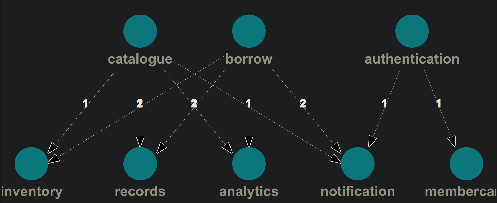

### 🇬🇧 English

The following trace captures the complete request lifecycle when a new chapter is created through the Catalogue Service.
It shows how a single business operation propagates across multiple services while maintaining trace context throughout
the distributed system.

### 🇯🇵 日本語

以下のトレースは、Catalogue
Serviceで新しいチャプターを作成した際の処理全体を示しています。単一のビジネスリクエストが複数のサービスへ伝播しながら、分散システム全体でトレースコンテキストが維持されていることを確認できます。

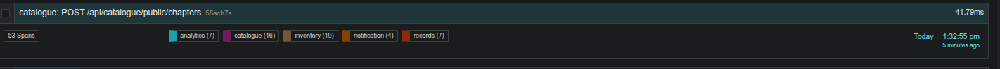

### 🇬🇧 English

Once the Catalogue Service publishes a domain event, multiple consumers process it independently. Jaeger visualizes the
complete asynchronous execution flow, allowing the propagation of Kafka events across bounded contexts to be traced from
producer to consumer.

### 🇯🇵 日本語

Catalogue Serviceがドメインイベントを発行すると、複数のコンシューマーが独立してイベントを処理します。Jaegerでは、Kafkaイベントが各Bounded
Contextへ非同期に伝播する様子を、ProducerからConsumerまで一貫して追跡できます。

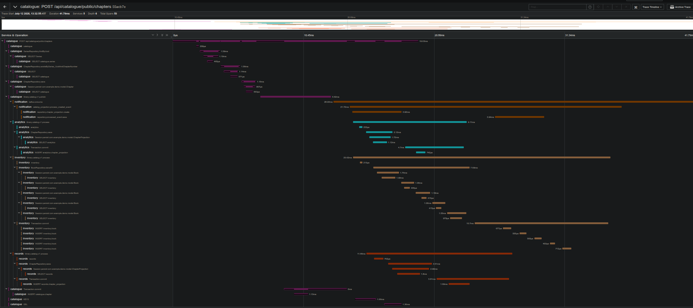

### 🇬🇧 English

Grafana dashboards provide real-time operational metrics collected by Prometheus. The following dashboard illustrates
the HTTP traffic handled by the Borrow Service, enabling request monitoring, performance analysis, and operational
troubleshooting.

### 🇯🇵 日本語

Grafanaダッシュボードでは、Prometheusが収集したリアルタイムメトリクスを可視化しています。以下の例ではBorrow
ServiceのHTTPリクエストを表示しており、リクエスト数やパフォーマンス、運用状況を継続的に監視できます。

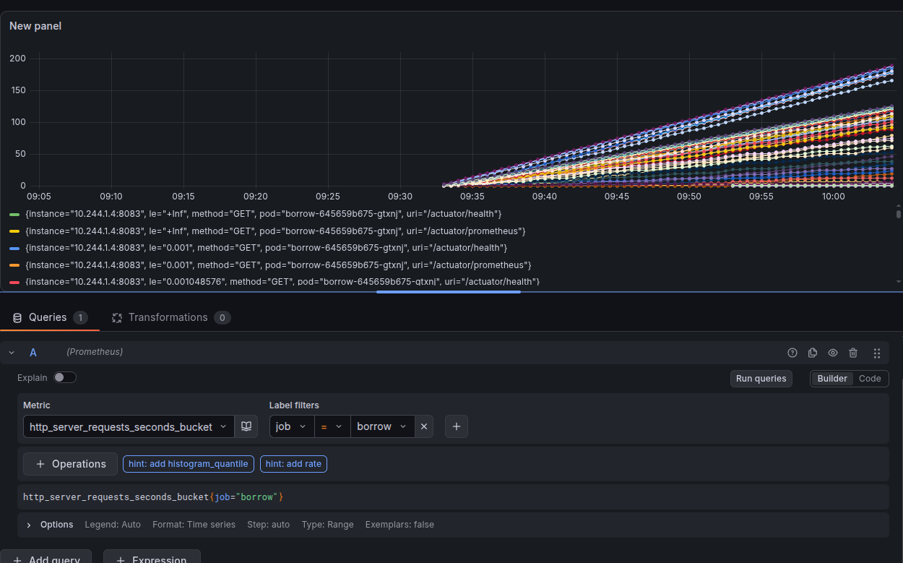

---

## 🚀 Continuous Delivery Pipeline / 継続的デリバリーパイプライン


### 🇬🇧 English

An end-to-end automated delivery pipeline ensuring code reliability, automated project management, and seamless
container publishing from commit to production.

### 🇯🇵 日本語

コミットから本番環境へのデリバリーまで、コードの信頼性確保、プロジェクト管理の自動化、およびコンテナのシームレスな公開を実現するエンドツーエンドの自動化パイプラインです。

---

### 🔄 Workflow Overview / ワークフロー概要

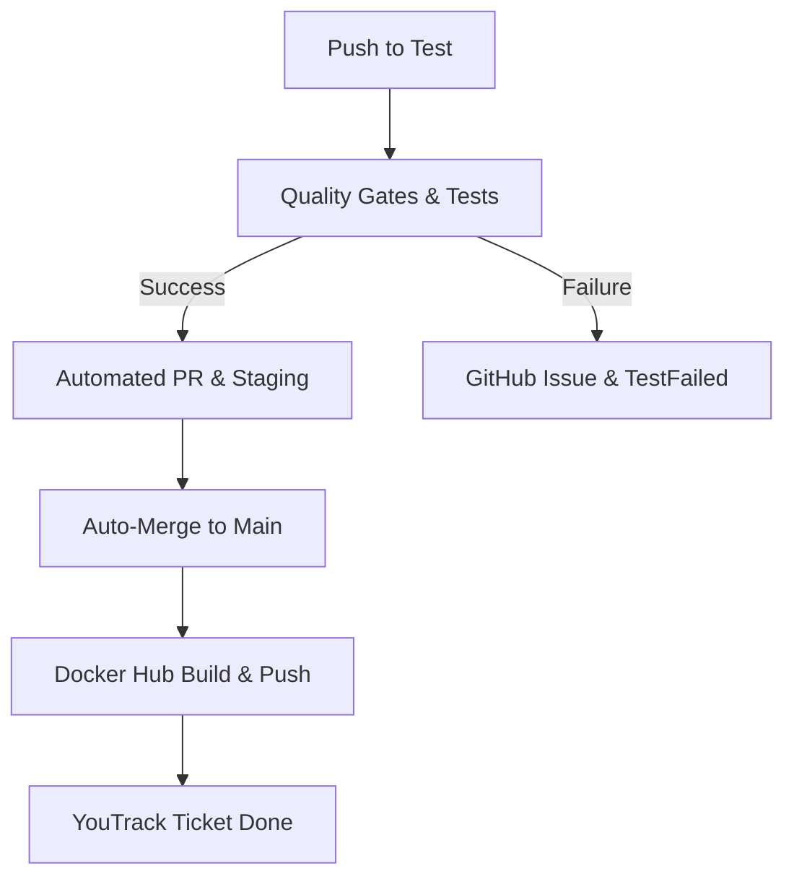
```mermaid
flowchart TD
    A[Push to Test] --> B[Quality Gates & Tests]
    B -->|Success| C[Automated PR & Staging]
    B -->|Failure| D[GitHub Issue & TestFailed]
    C --> E[Auto-Merge to Main]
    E --> F[Docker Hub Build & Push]
    F --> G[YouTrack Ticket Done]

```

1. 🧪 Quality Gates & Validation / 品質ゲートと検証

**EN:**
Executes unit tests and integration tests using JDK 21 to ensure correctness across isolated logic and system
interactions.

On failure: Automatically creates a GitHub Issue and moves the corresponding YouTrack ticket to TestFailed.

**JP:**
JDK 21環境でユニットテストおよび統合テストを実行し、ロジック単体およびシステム全体の整合性を検証。

テスト失敗時： GitHub Issueを自動作成し、YouTrackチケットを TestFailed に移動。

2. 🤖 Promotion Logic / プロモーションロジック

**EN:**
On success: Creates a Pull Request to main, applies labels (Staging, TestsPassed), moves YouTrack ticket to Staging, and
automatically merges the PR.

👉 Enables a fully automated, label-driven workflow.

**JP:**
テスト成功時： mainへのPull Requestを自動作成し、Staging・TestsPassedラベルを付与、YouTrackチケットを Staging
に移動してPRを自動マージ。

👉 ラベルベースの完全自動ワークフローを実現。

3. 📦 Immutable Releases & Registry Sync / イミュータブルリリースとレジストリ連携

**EN:**
Retrieves the exact Git SHA from artifacts and tags the Docker image to ensure 1:1 traceability between code and
deployment artifact.

Builds and pushes the production-ready image to Docker Hub.

**JP:**
ArtifactからGit SHAを取得しDockerイメージにタグ付けすることで、コードとデプロイ成果物の完全な対応関係を保証。
本番用イメージをビルドしDocker HubへPush。

✅ 4. Finalization / 完了処理

**EN:**
Automatically moves the YouTrack ticket to Done, closing the delivery loop.
👉 Guarantees end-to-end automation from commit to delivery.

**JP:**
YouTrackチケットを Done に移動し、デリバリープロセスを完結。
👉 コミットからデプロイまでの完全自動化を実現。

---

## 🔄 Borrow Flow / 貸出処理フロー

This diagram illustrates the business flow when a user borrows a book.  
The request is processed by the Borrow Service, which validates the operation and publishes an event to Kafka.  
Other services then react asynchronously to update their respective domains.

この図は、ユーザーが本を借りる際の業務フローを示しています。  
リクエストはBorrow Serviceで処理され、検証後にKafkaへイベントが発行されます。  
その後、各サービスが非同期でイベントを処理し、それぞれのデータを更新します。


---

## ⏳ Eventual Consistency Flow / 結果整合性フロー

This diagram illustrates how the system achieves eventual consistency using an event-driven architecture.  
When a user performs a borrow action, the system responds immediately while propagating changes asynchronously across
multiple services via Kafka.

この図は、イベント駆動アーキテクチャにおける結果整合性（Eventual Consistency）の仕組みを示しています。  
ユーザーが貸出操作を行うと、システムは即時にレスポンスを返し、その後Kafkaを通じて各サービスに非同期で変更が伝播されます。

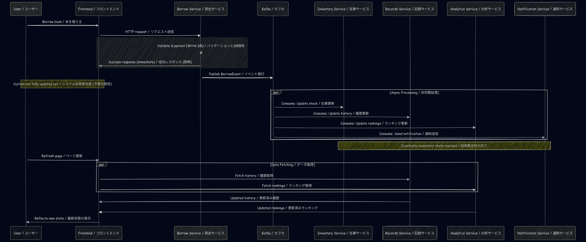

---

## 🧠 Engineering Takeaways / 学び

EN:

- Designing for eventual consistency changes how you think about data
- Event-driven systems require strong observability
- Decoupling services improves scalability but increases complexity

JP:

- 結果整合性を前提とした設計はデータ設計の考え方を大きく変える
- イベント駆動システムでは可観測性が不可欠
- サービスの疎結合はスケーラビリティを向上させるが複雑性も増加する

---

## ⚖️ Architectural Trade-offs / アーキテクチャのトレードオフ

Every architectural decision introduces benefits but also compromises. This project intentionally embraces several
trade-offs to demonstrate production-grade patterns.

各アーキテクチャの決定には利点と妥協が存在します。このプロジェクトでは、プロダクションレベルのパターンを示すために、意図的にいくつかのトレードオフを採用しています。

| Decision              | Benefit               | Trade-off              |
|:----------------------|:----------------------|:-----------------------|
| **Kafka**             | Loose coupling        | Eventual consistency   |
| **Local Projections** | Consumer autonomy     | Data duplication       |
| **Kubernetes**        | Scalability           | Operational complexity |
| **CQRS**              | Optimized read models | More infrastructure    |
| **Managed databases** | Stateless pods        | Network latency        |

---

### 🚀 Summary

This project demonstrates a production-inspired distributed system with real-world architectural patterns such as CQRS,
event-driven design, and microservices.

本プロジェクトはCQRS、イベント駆動設計、マイクロサービスといった実務レベルのアーキテクチャを再現しています。

---

## 👤 Author / 作成者

<p align="center">

Built as a portfolio project to demonstrate modern backend engineering practices

モダンなバックエンド設計を実証するためのポートフォリオプロジェクト

<br/>

Made with ❤️ by <b>Damou</b>

<a href="https://github.com/damouu">GitHub</a> •
<a href="https://www.linkedin.com/">LinkedIn</a>

<br/>

JLPT N1 | Backend & Platform Engineer

</p>
